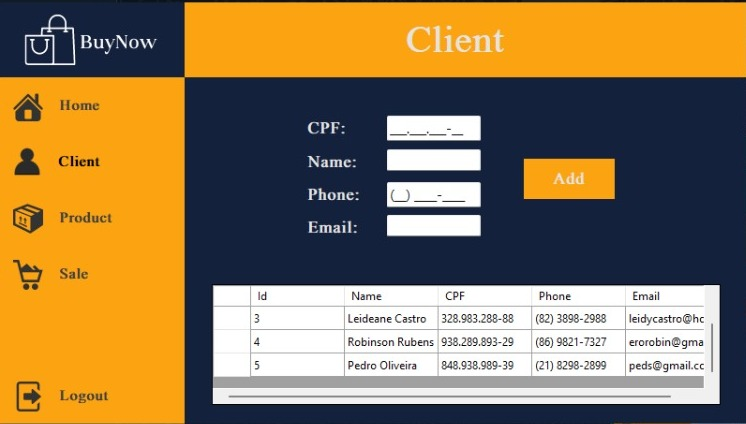
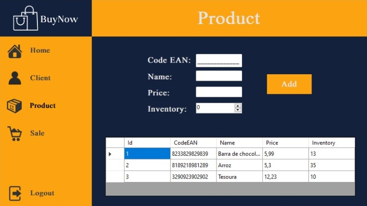
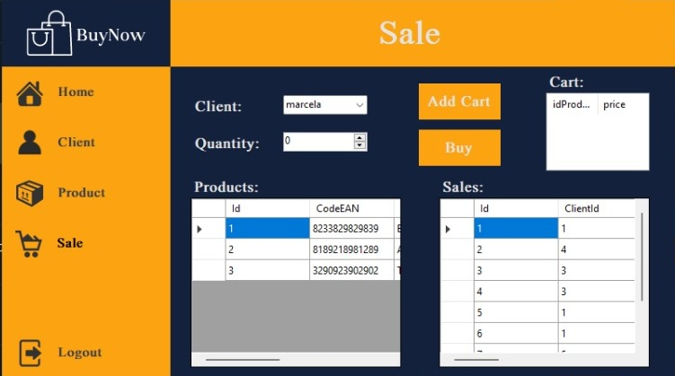

# SystemSales-WinForms
## Windows Form + EntityFramework

Projeto que o usuário cadastre clientes e produtos, e permite que o sistema realize vendas a partir dos clientes e produtos cadastrados.

## Tela Inicial

## Tela de cadastro de clintes

## Tela de cadastro de produtos

## Tela de adicionar vendas

